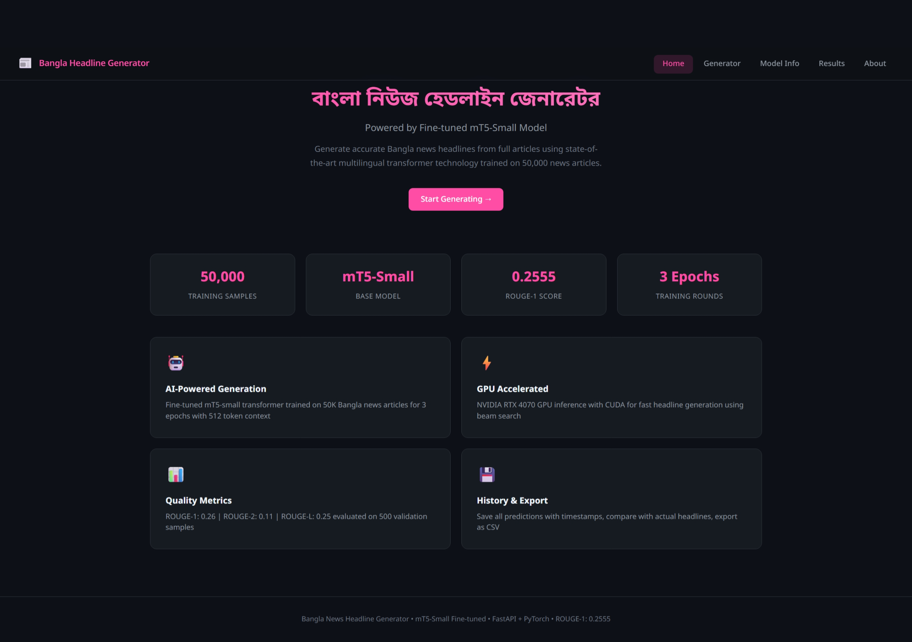
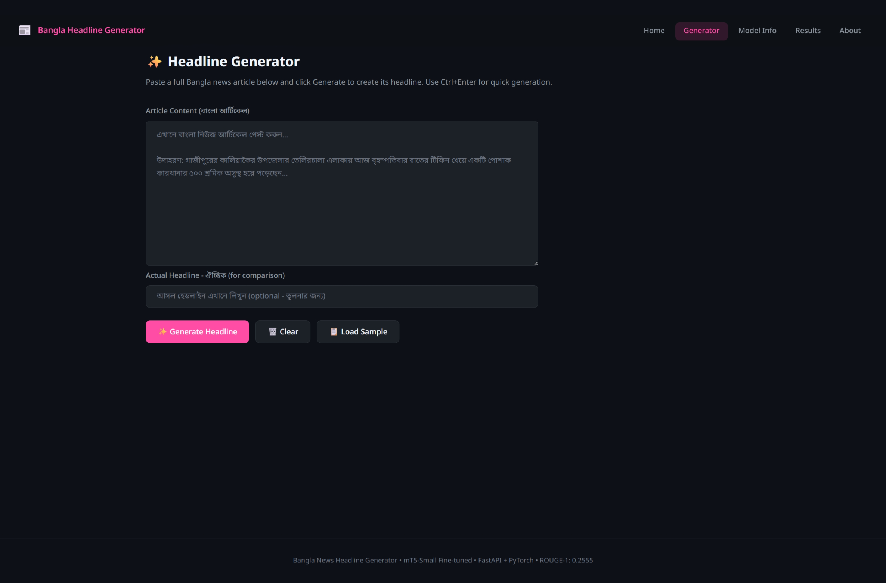
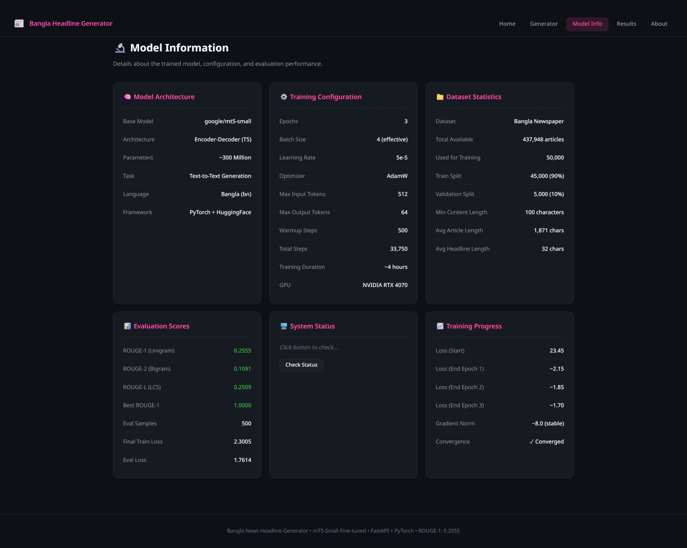
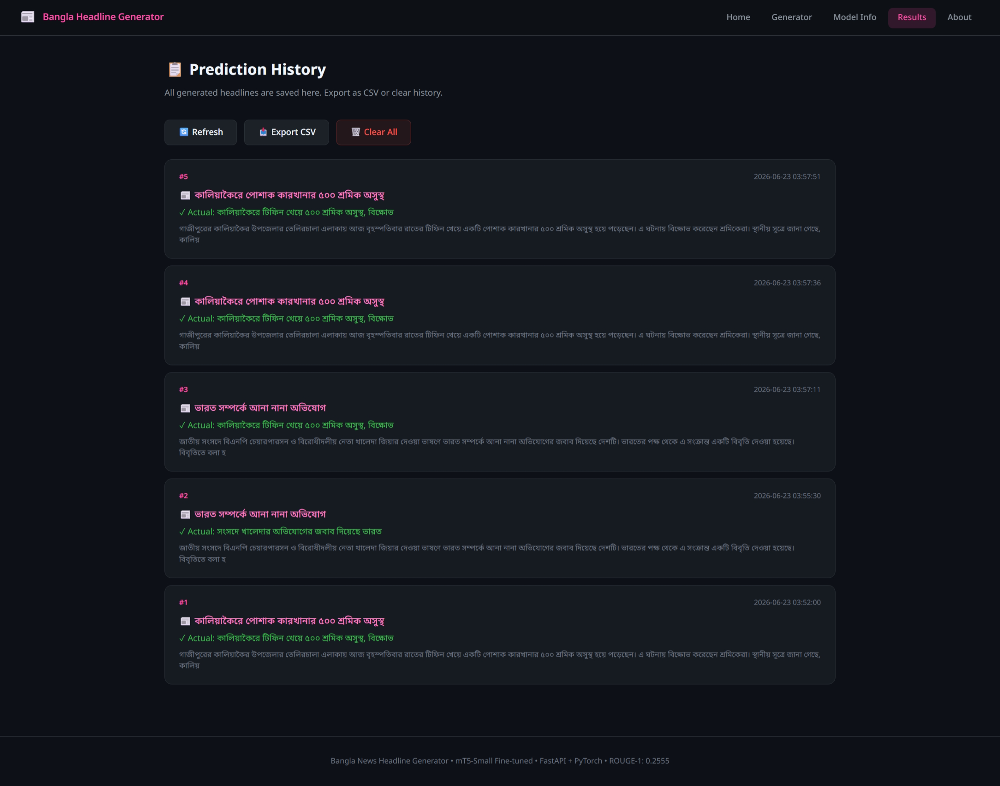
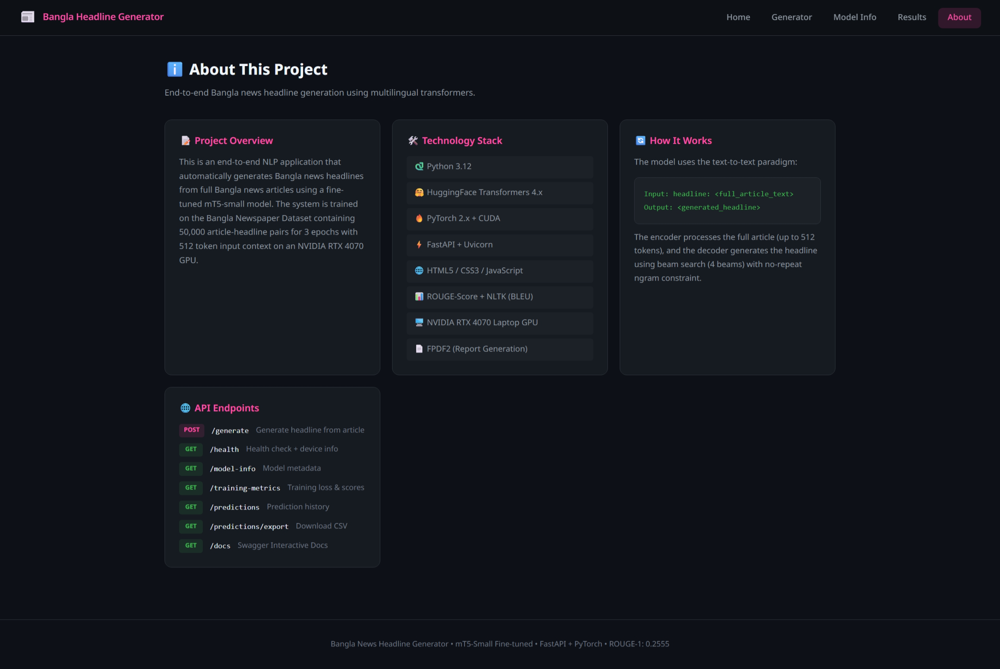

<div align="center">

# 📰 বাংলা নিউজ হেডলাইন জেনারেটর
### Bangla News Headline Generation using mT5-Small

[](https://python.org)
[](https://pytorch.org)
[](https://huggingface.co)
[](https://fastapi.tiangolo.com)
[](https://nvidia.com)

<br>

> **End-to-end NLP application** that automatically generates accurate Bangla news headlines from full articles using a fine-tuned multilingual T5 transformer model.

<br>

| Metric | Score |
|--------|-------|
| 🎯 ROUGE-1 | **0.2555** |
| 📊 ROUGE-2 | **0.1091** |
| 📈 ROUGE-L | **0.2509** |
| ⏱️ Training | **4 hours** |
| 📚 Dataset | **50,000 articles** |

</div>

---

## 🖼️ Screenshots

### 🏠 Home Page
<p align="center">
  
</p>

### ✨ Headline Generator
<p align="center">
  
</p>

### 🔬 Model Information
<p align="center">
  
</p>

### 📋 Prediction Results
<p align="center">
  
</p>

### ℹ️ About & API Documentation
<p align="center">
  
</p>

---

## 🚀 Key Features

<table>
<tr>
<td width="50%">

### 🤖 AI-Powered Generation
- Fine-tuned **mT5-small** (300M params)
- Trained on **50,000** Bangla news articles
- **3 epochs** with 512 token context
- Beam search (4 beams) decoding

</td>
<td width="50%">

### ⚡ GPU Accelerated Inference
- NVIDIA **RTX 4070** CUDA support
- Automatic GPU/CPU detection
- Fast real-time headline generation
- No-repeat ngram constraint

</td>
</tr>
<tr>
<td width="50%">

### 📊 Comprehensive Evaluation
- ROUGE-1, ROUGE-2, ROUGE-L metrics
- BLEU score calculation
- PDF & JSON evaluation reports
- Custom Bangla tokenizer for scoring

</td>
<td width="50%">

### 🌐 Modern Web Dashboard
- Dark theme UI with responsive design
- Real-time headline generation
- Similarity score visualization
- Prediction history with CSV export

</td>
</tr>
</table>

---

## 🏗️ Architecture

```
┌─────────────────┐     ┌──────────────────┐     ┌─────────────────┐
│  Bangla Article  │────▶│  mT5 Encoder     │────▶│  mT5 Decoder    │
│  (512 tokens)    │     │  (6 layers)      │     │  (6 layers)     │
└─────────────────┘     └──────────────────┘     └────────┬────────┘
                                                           │
                                                           ▼
                                                  ┌─────────────────┐
                                                  │ Generated       │
                                                  │ Headline (64t)  │
                                                  └─────────────────┘
```

**Input Format:** `headline: <full_article_text>`  
**Output:** `<generated_bangla_headline>`

---

## 📁 Project Structure

```
📦 Bangla_dataset/
├── 📂 app/
│   ├── __init__.py
│   ├── config.py           # All configuration parameters
│   ├── inference.py        # HeadlineGenerator class (GPU/CPU)
│   ├── main.py             # FastAPI application + endpoints
│   └── utils.py            # Helper functions
├── 📂 training/
│   ├── __init__.py
│   ├── preprocess.py       # Data loading, cleaning, splitting
│   ├── train.py            # Full training pipeline
│   └── evaluate.py         # ROUGE/BLEU evaluation + reports
├── 📂 frontend/
│   ├── index.html          # Dashboard UI (5 pages)
│   ├── style.css           # Dark theme styles
│   └── script.js           # Frontend logic & API calls
├── 📂 model/
│   └── saved_model/        # Trained model weights (gitignored)
├── 📂 dataset/
│   └── data.json           # Bangla Newspaper Dataset (gitignored)
├── 📂 reports/
│   ├── training_metrics.json
│   ├── evaluation_report.json
│   ├── evaluation_report.pdf
│   └── loss_curve.png
├── 📂 screenshots/         # UI screenshots
├── requirements.txt
├── .gitignore
└── README.md
```

---

## ⚙️ Model & Training Details

<table>
<tr><th>Parameter</th><th>Value</th></tr>
<tr><td>Base Model</td><td><code>google/mt5-small</code></td></tr>
<tr><td>Parameters</td><td>~300 Million</td></tr>
<tr><td>Architecture</td><td>Encoder-Decoder (T5)</td></tr>
<tr><td>Training Samples</td><td>45,000</td></tr>
<tr><td>Validation Samples</td><td>5,000</td></tr>
<tr><td>Epochs</td><td>3</td></tr>
<tr><td>Effective Batch Size</td><td>4 (2 × grad accum)</td></tr>
<tr><td>Learning Rate</td><td>5e-5</td></tr>
<tr><td>Optimizer</td><td>AdamW</td></tr>
<tr><td>Warmup Steps</td><td>500</td></tr>
<tr><td>Max Input Length</td><td>512 tokens</td></tr>
<tr><td>Max Output Length</td><td>64 tokens</td></tr>
<tr><td>Training Duration</td><td>~4 hours</td></tr>
<tr><td>GPU</td><td>NVIDIA RTX 4070 (8GB)</td></tr>
<tr><td>Final Train Loss</td><td>2.3005</td></tr>
<tr><td>Eval Loss</td><td>1.7614</td></tr>
</table>

### 📉 Training Loss Progression

| Stage | Loss |
|-------|------|
| Start | 23.45 |
| End Epoch 1 | ~2.15 |
| End Epoch 2 | ~1.85 |
| End Epoch 3 | ~1.70 |

---

## 📊 Evaluation Results

| Metric | Score | Description |
|--------|-------|-------------|
| **ROUGE-1** | 0.2555 | Unigram overlap (F1) |
| **ROUGE-2** | 0.1091 | Bigram overlap (F1) |
| **ROUGE-L** | 0.2509 | Longest Common Subsequence |
| **Best ROUGE-1** | 1.0000 | Perfect match on some samples |
| **Eval Samples** | 500 | Validation set evaluation |

### 📝 Sample Predictions

| Generated | Reference | Match |
|-----------|-----------|-------|
| আপনার রাশিফল | আপনার রাশিফল | ✅ 100% |
| ১৪ মে হতে আইনগত কোনো বাধা নেই | এফবিসিসিআই নির্বাচন ১৪ মে তারিখেই হবে | 🟡 Partial |
| রমনা অঞ্চলের পুলিশ... বিপাকে ব্যবসায়ীরা | অভিযোগ করে আরও বিপাকে ব্যবসায়ীরা | 🟡 Partial |

---

## 📚 Dataset Details

<table>
<tr><td><b>Dataset</b></td><td>Bangla Newspaper Dataset</td></tr>
<tr><td><b>Total Records</b></td><td>437,948 articles</td></tr>
<tr><td><b>Used for Training</b></td><td>50,000</td></tr>
<tr><td><b>Format</b></td><td>JSON <code>{"title": "...", "content": "..."}</code></td></tr>
<tr><td><b>Avg Article Length</b></td><td>1,871 characters</td></tr>
<tr><td><b>Avg Headline Length</b></td><td>32 characters</td></tr>
<tr><td><b>Min Content Filter</b></td><td>100 characters</td></tr>
<tr><td><b>Source</b></td><td>Prothom Alo (Bangla Newspaper)</td></tr>
</table>

---

## 🛠️ Installation & Setup

### Prerequisites
- Python 3.8+
- CUDA-capable GPU (recommended)
- 8GB+ VRAM for training

### 1. Clone Repository
```bash
git clone https://github.com/gaurikh09/NLP_IIIT_BHOPAL_RESEARCH.git
cd NLP_IIIT_BHOPAL_RESEARCH
```

### 2. Install Dependencies
```bash
pip install -r requirements.txt
```

### 3. Prepare Dataset
Place your `data.json` file in the `dataset/` directory.

### 4. Train Model
```bash
python training/train.py
```

### 5. Evaluate Model
```bash
python training/evaluate.py
```

### 6. Run Web Application
```bash
uvicorn app.main:app --host 0.0.0.0 --port 8000
```

### 7. Open Dashboard
```
http://localhost:8000
```

---

## 🌐 API Documentation

### `POST /generate`
Generate a headline from a Bangla article.

```json
// Request
{
  "article": "গাজীপুরের কালিয়াকৈর উপজেলার...",
  "actual_headline": "কালিয়াকৈরে টিফিন খেয়ে ৫০০ শ্রমিক অসুস্থ"
}

// Response
{
  "headline": "কালিয়াকৈরে পোশাক কারখানার ৫০০ শ্রমিক অসুস্থ",
  "actual_headline": "কালিয়াকৈরে টিফিন খেয়ে ৫০০ শ্রমিক অসুস্থ",
  "input_length": 425,
  "device": "cuda",
  "timestamp": "2026-06-23 03:57:51"
}
```

### `GET /health`
```json
{"status": "running", "model_loaded": true, "device": "cuda"}
```

### `GET /model-info`
Returns model architecture details.

### `GET /predictions`
Returns all prediction history.

### `GET /predictions/export`
Downloads predictions as CSV file.

### `GET /docs`
Interactive Swagger API documentation.

---

## 🖥️ Running on Google Colab / Kaggle

```python
# Install dependencies
!pip install -r requirements.txt

# Train the model
!python training/train.py

# Evaluate
!python training/evaluate.py

# Run API with ngrok for public access
!pip install pyngrok
from pyngrok import ngrok
public_url = ngrok.connect(8000)
print(f"Dashboard: {public_url}")

!uvicorn app.main:app --host 0.0.0.0 --port 8000
```

---

## 🛠️ Technology Stack

| Component | Technology |
|-----------|-----------|
| Language | Python 3.12 |
| Deep Learning | PyTorch 2.x + CUDA |
| NLP Framework | HuggingFace Transformers |
| Model | google/mt5-small |
| Tokenizer | SentencePiece |
| Web Framework | FastAPI + Uvicorn |
| Frontend | HTML5, CSS3, JavaScript |
| Evaluation | rouge-score, NLTK |
| Report Gen | FPDF2 |
| GPU | NVIDIA RTX 4070 Laptop |

---

## 🔮 Future Scope

- [ ] Switch to **BanglaT5** for better Bangla-specific performance
- [ ] Train on full **400K+** articles dataset
- [ ] Upgrade to **mT5-base** (580M params)
- [ ] Add extractive + abstractive hybrid approach
- [ ] Implement streaming generation with SSE
- [ ] Deploy on cloud (AWS/GCP/Azure)
- [ ] Add user authentication & rate limiting
- [ ] Build mobile app with React Native
- [ ] A/B testing between models
- [ ] Multi-document summarization support

---

## 👥 Contributors

| Role | Details |
|------|---------|
| **Researcher** | IIIT Bhopal NLP Research |
| **Framework** | HuggingFace Transformers |
| **Model** | Google mT5-Small |
| **Dataset** | Bangla Newspaper Dataset |

---

## 📄 License

This project is for **educational and research purposes** at IIIT Bhopal.

---

<div align="center">

### ⭐ Star this repo if you found it useful!

**Made with ❤️ for Bangla NLP Research**

[](https://github.com/gaurikh09)

</div>
